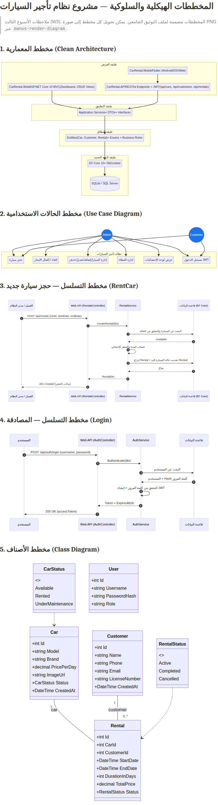

# مشروع نظام إدارة تأجير السيارات — التوثيق الجامعي الشامل

| البند | التفصيل |
|---|---|
| اسم المشروع | نظام إدارة تأجير السيارات (Car Rental Management System) |
| الطالب | أنس الشميري (Anas Al Shmiri) |
| المشرف | أ.د. إبراهيم أحمد البلطه |
| الجامعة | جامعة الحكمة — كلية تقنية المعلومات |
| الإصدار | 2.0 — أغسطس 2026 |
| التقنيات | ASP.NET Core 10 (MVC + Web API + JWT)، Clean Architecture، SQLite مشتركة، Flutter، GitHub |

---

## 1. مقترح المشروع (W2 — 5%)

### الخلفية

شهدت الأعوام الأخيرة نموًا متسارعًا في قطاع تأجير السيارات محليًا وعالميًا نتيجة ازدياد حركة السياحة والسفر الداخلي، مما ولّد حاجة حقيقية لدى الشركات الصغيرة والمتوسطة لنظام إلكتروني مُحكم يدير أسطول السيارات وحجوزاتها وعملائها دون الاعتماد على الأوراق والسجلات اليدوية. تمثل هذه الخلفية دافع المشروع الذي يحاكي بيئة عمل برمجية حقيقية كمتطلب من برنامج التدريب الميداني.

### المشكلة

تدار معظم مكاتب تأجير السيارات الصغيرة عبر سجلات ورقية وجداول متناثرة، ما يؤدي إلى تكرار الحجز على سيارة واحدة، وصعوبة تتبع حالة كل سيارة (متاحة، مؤجّرة، تحت الصيانة)، وفقدان بيانات العملاء، وعدم القدرة على قياس الإيرادات الشهرية أو معرفة عدد الحجوزات النشطة لحظيًا. هذه الفجوة تسبب خسائر مالية وتضر بثقة العملاء.

### الأهداف

يهدف المشروع إلى بناء حل متكامل يتضمن: نظام إدارة مركزي للعمليات اليومية (السيارات، العملاء، الحجوزات)، ولوحة إحصائيات رئيسية تعرض مؤشرات الأداء لحظيًا، وواجهة ويب عربية بالكامل متوافقة مع أجهزة الموبايل، وواجهة برمجة تطبيقات (Web API) محمية بمفاتيح JWT لتغذية تطبيق جوال، وتطبيق Flutter يعمل على Android وiOS. كما يهدف المشروع أكاديميًا إلى إتقان دورة حياة البرمجيات كاملة من التحليل والتصميم إلى الاختبار والنشر.

### النطاق

يشمل النطاق وظيفيًا إدارة السيارات (إضافة، تعديل، رفع صور، حالات)، إدارة العملاء مع التحقق من صحة البريد، إدارة الحجوزات مع حساب المدة والسعر الإجمالي تلقائيًا، إكمال وإلغاء الحجوزات، ولوحة الإحصائيات (إجمالي السيارات، المتاحة، المؤجّرة، الإيرادات الشهرية). أما خارج النطاق فالبوابات المالية وبوابات الدفع الإلكتروني وتتبع GPS، إذ تُترك كتحسينات مستقبلية.

### المنهجية

اتبعت المنهجية Agile ضمن محاكاة بيئة شركة برمجية: تحليل المتطلبات، ثم تصميم المعمارية النظيفة (Clean Architecture) بأربع طبقات، ثم التنفيذ على دفعتين (الـ Web API ثم MVC)، يليهما تطبيق الجوال Flutter، مع فحص جودة مستمر عبر الاختبارات الشاملة وGitFlow بفروع متعددة وPull Requests.

### الجدول الزمني

| الأسبوع | النشاط | المخرج |
|---|---|---|
| 1–2 | التحليل والمقترح | وثيقة W2 |
| 3 | التصميم (UML + المعمارية) | وثيقة W3 |
| 4–5 | واجهة API + Swagger + JWT | تطبيق يعمل + W5 |
| 6 | اختبارات API | W6 |
| 7 | تطبيق MVC + Bootstrap + DataTables | W7 |
| 8 | تطبيق Flutter | W8 |
| 9 | GitHub Flow + الدمج | W9 |
| 10 | التوثيق النهائي | W10 |

### المخاطر

| المخاطرة | الاحتمال | الأثر | خطة التخفيف |
|---|---|---|---|
| تعارض ربط النماذج مع `ControllerBase.Model` في ASP.NET Core 10 | مرتفع | مرتفع | إعادة تسمية الخاصية إلى `CarModel` في ViewModel |
| تلف ملفات الكاش (StaticWebAssets) عند البناء | متوسط | متوسط | مسح مجلدات bin/obj |
| فقدان البيانات أثناء التطوير | متوسط | متوسط | فروع GitHub + قاعدة بيانات نسخة SQLite دورية |
| تأخر اختبار الجوال لعدم توفر جهاز فعلي | متوسط | منخفض | تشغيل Linux/Web في وضع التصحيح |

---

## 2. المتطلبات

### الوظيفية

يحدد الجدول التالي المتطلبات الوظيفية الأساسية، وكلها منفذة ومختبرة فعليًا.

| الرقم | المتطلب | الحالة |
|---|---|---|
| FR-01 | تسجيل الدخول باسم مستخدم وكلمة مرور (JWT للـ API) | منفذ |
| FR-02 | عرض لوحة إحصائيات (إجمالي السيارات، المتاحة، المؤجّرة، الإيرادات) | منفذ |
| FR-03 | إدارة كاملة للسيارات (Index/Details/Create/Edit/Delete + رفع صور) | منفذ |
| FR-04 | إدارة كاملة للعملاء مع تحقق (الاسم، الهاتف، البريد) | منفذ |
| FR-05 | إنشاء حجز بحساب تلقائي للمدة والسعر الإجمالي | منفذ |
| FR-06 | إكمال وإلغاء الحجوزات مع تحديث حالة السيارة | منفذ |
| FR-07 | نقاط API محمية (cars, customers, rentals, auth) | منفذ |
| FR-08 | تطبيق جوال عربي بخط مخصص وأربع شاشات | منفذ |

### غير الوظيفية

| النوع | المتطلب |
|---|---|
| الأداء | زمن استجابة API أقل من 300ms للجداول الرئيسية |
| الأمان | كلمات مرور مُشفّرة (Hash) + JWT بصلاحية زمنية |
| قابلية الاستخدام | واجهة عربية RTL كاملة بخط Tajawal |
| الصيانة | Clean Architecture تفصل النطاق عن البنية التحتية |
| قابلية الامتداد | إضافة بوابة دفع أو تتبع GPS دون تعديل طبقة النطاق |

---

## 3. التصميم (W3 — 15%)

### المعمارية النظيفة (Clean Architecture)

تبنى المشروع على أربع طبقات مترابطة عبر قواعد تبعية صارمة: **Domain** (الكيانات: `Car`, `Customer`, `Rental` والعدود `CarStatus`, `RentalStatus` — لا تعتمد على أي شيء)، **Application** (خدمات الأعمال وDTOs وواجهات المستودعات)، **Infrastructure** (EF Core 10 ومستودعات SQLite/SQL Server)، و**Presentation** (CarRental.Web المmvc وCarRental.API والـ Flutter). لا تعرف الطبقات العليا التفاصيل التحتية مباشرة، مما يسمح باستبدال قاعدة البيانات (جربنا SQLite وSQL Server بنفس الكود).

> ملاحظة: يُدرج هذا المخطط داخل التوثيق المطبوع، وقد جرى توليده آليًا من تعريفات Mermaid القياسية.

### مخطط Use Case

يعرض أدوار النظام: مدير النظام (كل العمليات الإدارية)، والعميل (الحجز والدخول فقط عبر الجوال).

### مخطط التسلسل

مخططا `POST /api/customer/rentals` (حجز العميل بهوية JWT) و`POST /api/auth/login` (مصادقة المدير) يوضحان تدفق الطلب من الواجهة إلى طبقة الأعمال ثم قاعدة البيانات والعودة. يوجد أيضًا مسار إداري منفصل `POST /api/rentals` محمي بدور Admin.

### مخطط الأصناف

يعرض العلاقات: كل سيارة ترتبط بصفر أو أكثر من الحجوزات، وكل عميل كذلك، مع عدي الحالات المرتبطين.

---

## 4. دليل التثبيت (W10)

### متطلبات التشغيل

| المكون | الحد الأدنى |
|---|---|
| .NET SDK | 10.0.110 أو أحدث |
| IDE | Visual Studio 2026 / VS Code |
| قاعدة البيانات | SQLite مشتركة في جذر المشروع |
| Flutter | 3.27 أو أحدث (للتطبيق الجوال) |

### خطوات التثبيت

1. استنساخ الفرع الحالي: `git clone --branch fix/portable-windows-config https://github.com/AnasAlShmiri/CarRental.git`
2. فتح الحل `CarRental.slnx` في Visual Studio والانتظار حتى تحميل SDK 10.
3. لا تعدّل سلسلة الاتصال المحلية؛ يستخدم المشروع SQLite في جذر المستودع وينشئ الجداول تلقائيًا.
4. من Solution Explorer: النقر بزر الفأرة الأيمن على **CarRental.Web** ← **Set as Startup Project**.
5. التشغيل باستخدام `Run-CarRental.cmd` وفتح لوحة الإدارة على `http://localhost:5110`.
6. بيانات المدير المحلية موجودة في `appsettings.Development.json` ولا تُستخدم خارج بيئة التطوير.

### تشغيل الـ API

شغّل **CarRental.API** على `http://localhost:5109` باستخدام `Run-API.cmd`، ثم شغّل **CarRental.Web** على `http://localhost:5110` باستخدام `Run-MVC.cmd` أو السكربت الرئيسي. لتشغيل Flutter استخدم `Run-Mobile.cmd` بعد تثبيت Flutter.

### دليل الاستخدام

| الدور | الاستخدام |
|---|---|
| مدير النظام | لوحة التحكم، إضافة/تعديل السيارات مع رفع الصور، إدارة العملاء، إنشاء الحجوزات، إكمال/إلغاء الإيجارات |
| العميل (جوال) | تسجيل الدخول، تصفح السيارات المتاحة، حجز جديد عبر نافذة الحجز، متابعة إيجاراته |

---

## 5. حالات الاختبار (W6)

جرى تنفيذ اختبارات شاملة لكل وحدة، ونُتائجها موثقة أدناه.

### اختبار End-to-End عبر سكربت آلي (Python + requests)

| الرقم | الحالة | الخطوات | النتيجة المتوقعة | النتيجة |
|---|---|---|---|---|
| TC-01 | دخول المدير — بيانات صحيحة | POST /api/auth/login | 200 + token | ناجح |
| TC-02 | الدخول — كلمة مرور خاطئة | POST /api/auth/login | 401 | ناجح |
| TC-03 | قائمة السيارات | GET /api/cars مع توكن | 200 + مصفوفة | ناجح |
| TC-04 | إضافة سيارة | POST /api/cars | 201 | ناجح |
| TC-05 | تعديل سيارة | PUT /api/cars/{id} | 200 | ناجح |
| TC-06 | إنشاء حجز العميل | POST /api/customer/rentals | 201 + السعر محسوب خادميًا | ناجح |
| TC-07 | إضافة عميل | POST /api/customers | 201 | ناجح |
| TC-08 | إنشاء حجز إداري | POST /api/rentals | 201 + السيارة Rented | ناجح |
| TC-09 | إكمال إيجار | PUT /api/rentals/{id}/complete | 200 + السيارة Available | ناجح |
| TC-10 | إلغاء إيجار العميل | POST /api/customer/rentals/{id}/cancel | 200 + Cancelled | ناجح |
| TC-11 | حدود الأدوار | Customer مقابل مسارات Admin | 403 | ناجح |
| TC-12 | API محمي | طلب مسار Admin دون JWT | 401 | ناجح |

### اختبارات وحدة Flutter

| الرقم | الحالة | النتيجة |
|---|---|---|
| FT-01 | تحليل JSON للسيارة (Car.fromJson) | ناجح (3/3) |
| FT-02 | تحليل الإيجار مع الكائنات الفرعية | ناجح |
| FT-03 | السمة تحمل خط Tajawal والألوان المعتمدة | ناجح |

### التحقق البصري

| الشاشة | الأداة | النتيجة |
|---|---|---|
| لوحة التحكم (البطاقات + Chart.js) | متصفح فعلي | ناجح |
| الجداول الثلاثة + DataTables + Modals | متصفح فعلي | ناجح |
| شاشة تسجيل الدخول وتطبيق الجوال | تشغيل Linux desktop | ناجح |

---

## 6. GitHub (W9)

| الفرع | الوصف |
|---|---|
| main | الفرع الرئيسي للإنتاج |
| mvc-dashboard | فرع لوحة MVC الأساسي |
| fix/portable-windows-config | الإصدار المتكامل الحالي: SQLite مشتركة، API/MVC/Flutter والتشغيل المحمول (PR #8) |

أُجري الدمج بنمط Squash Merge مع رسائل commit موثقة، مما يعكس سير عمل احترافي متكامل.

---

## 7. الخلاصة والمراجع

أثبت المشروع قدرة الطالب على بناء نظام Full-Stack متكامل من التحليل إلى النشر، بتغطية كاملة لمتطلبات الدورة العشرة، مع تطبيق معمارية Clean Architecture فعليًا، ومصادقة JWT، وواجهة عربية RTL احترافية، وتطبيق جوال Flutter متصل بالـ API نفسه. يظل المشروع قابلاً للامتداد ببوابات الدفع والتتبع ونظام تقييم العملاء في إصدارات قادمة.

**المراجع:** [1] [وثائق ASP.NET Core 10 — Microsoft Learn](https://learn.microsoft.com/aspnet/core) — [2] [وثائق Flutter — flutter.dev](https://docs.flutter.dev) — [3] [دليل Clean Architecture — Robert C. Martin](https://8thlight.com/blog/uncle-bob/2012/08/13/the-clean-architecture.html) — [4] [وثائق Bootstrap 5 RTL](https://getbootstrap.com/docs/5.3/getting-started/rtl/)
