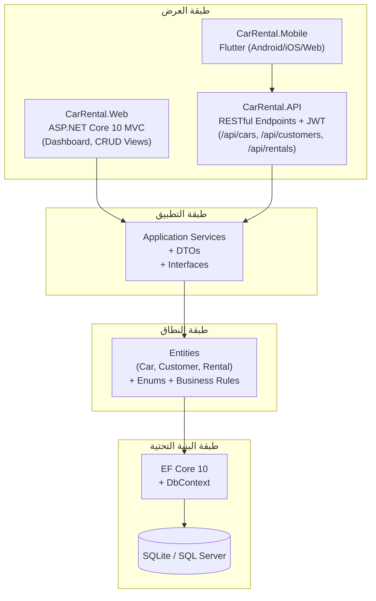
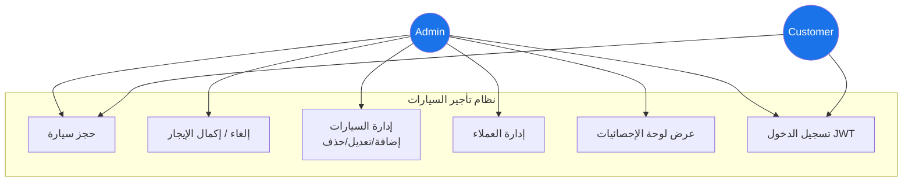
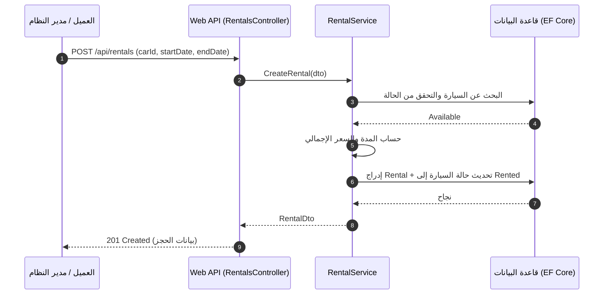
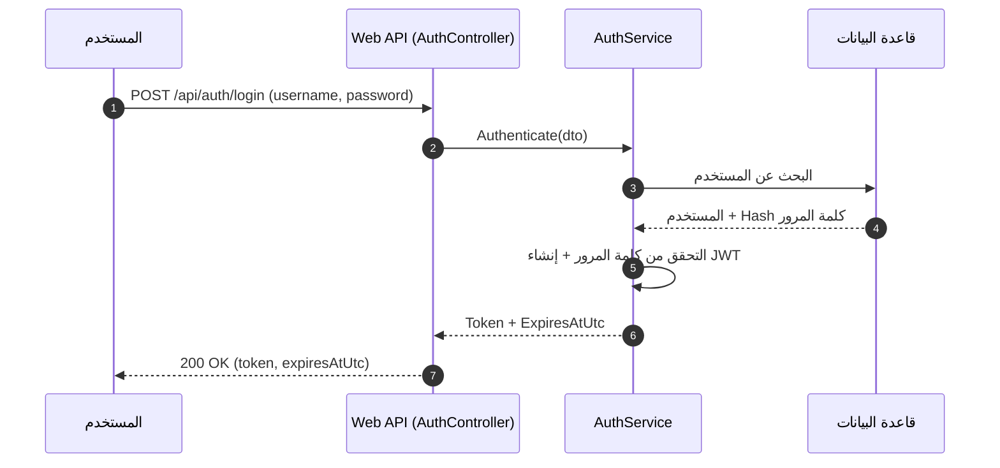
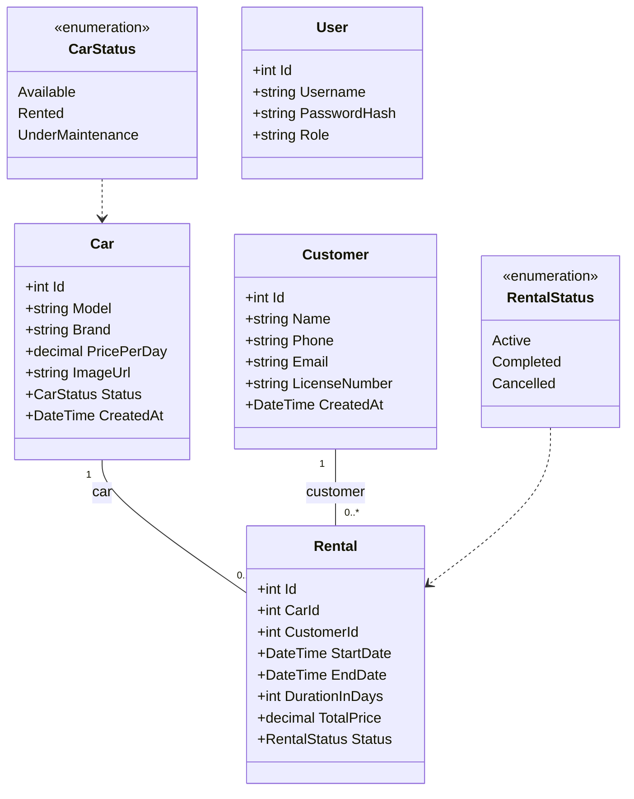

# المخططات الهيكلية والسلوكية — مشروع نظام تأجير السيارات

> ملاحظات الأسبوع الثالث (W3): المخططات مصممة لملف التوثيق الجامعي. يمكن تحويل كل مخطط إلى صورة PNG عبر `manus-render-diagram`.

## 1. مخطط المعمارية (Clean Architecture)

## 2. مخطط الحالات الاستخدامية (Use Case Diagram)

## 3. مخطط التسلسل — حجز سيارة جديد (RentCar)

## 4. مخطط التسلسل — المصادقة (Login)

## 5. مخطط الأصناف (Class Diagram)

